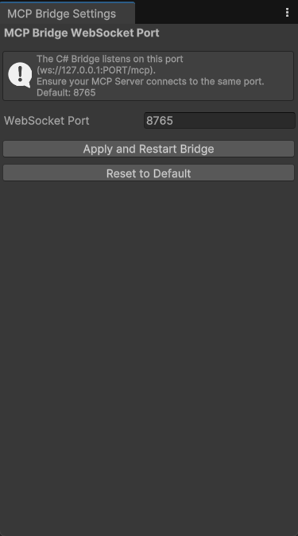

# MCP Unity Bridge Asset

A Unity Editor package that enables seamless communication between Unity and Model Context Protocol (MCP) servers, specifically designed to work with the MCP Unity Manager Server. This bridge allows AI-powered tools and external applications to programmatically control and automate Unity Editor operations through a secure WebSocket interface.

## This is the Unity Editor Asset for the MCP Unity Manager Server

See [MCP Unity Manager Server](https://github.com/bsmi021/mcp-unity-manager-server) for more information.

## Overview

The MCP Unity Bridge Asset serves as a WebSocket-based communication layer between your Unity Editor and MCP servers. It translates incoming JSON commands into Unity Editor API calls, enabling remote control of:

- Asset Management (creation, deletion, import)
- GameObject Operations (creation, modification, component management)
- Scene Management (loading, saving, creation)
- Editor Automation Tasks

## Key Features

- **WebSocket Communication**: Maintains a persistent, secure connection with MCP servers
- **Main Thread Execution**: Safely handles Unity Editor API calls with proper thread synchronization
- **JSON-based Protocol**: Structured communication format for reliable data exchange
- **Extensible Architecture**: Easy to add new command handlers through modular design
- **Editor-Time Integration**: Seamlessly integrates with Unity Editor workflows
- **Comprehensive Logging**: Detailed logging and debugging capabilities

## Prerequisites

- Unity 2022.3 LTS or later (fully tested with 2022.3.0f1)
- MCP Unity Manager Server v0.1.0 or later
- Git (for package installation)
- .NET 4.x Scripting Runtime

## Installation

1. Open your Unity project
2. Open the Package Manager (Window > Package Manager)
3. Click the '+' button in the top-left corner
4. Select "Add package from git URL..."
5. Enter the following URL:

   ```
   https://github.com/bsmi021/mcp-unity-bridge-asset.git
   ```

6. Click 'Add'

The package will be installed and automatically integrated into your Unity Editor. You can verify the installation by checking for the MCP Bridge menu under Tools.

## Usage

### Initial Setup

1. Open your Unity project containing the MCP Unity Bridge Asset
2. Navigate to Tools > MCP Bridge > Settings in the Unity Editor menu
3. Configure the following settings:
   - WebSocket Port (default: 8765)
   - Auto-Start on Editor Load (recommended: enabled)
   - Logging Level (default: Info)
   - Command Timeout (default: 30 seconds)
   - Max Message Size (default: 5MB)



### Verifying Installation

1. Open the Unity Console window (Window > General > Console)
2. Look for the `[MCPBridge-Loader]` messages
3. You should see "WebSocket server started on port 8765" (or your configured port)
4. If using with MCP Unity Manager Server, you'll see a connection confirmation message

### Security Note

The bridge operates only in the Unity Editor and is not intended for runtime use in builds. It should only be used in development environments with appropriate network security measures in place.

## Architecture

### Component Structure

1. **Bridge Loader**: Editor-time initialization and configuration management
2. **WebSocket Server**: Handles communication with MCP clients
3. **Command Processor**: Routes and executes incoming commands
4. **Response Handler**: Formats and sends command results
5. **Security Manager**: Validates incoming connections and commands
6. **Logger**: Comprehensive logging system

### Message Format

All communication uses JSON with the following structure:

```json
{
  "command": "string",      // The command to execute
  "params": {},            // Command-specific parameters
  "requestId": "string",   // Unique identifier for the request
  "version": "string"      // API version for compatibility
}
```

### Supported Commands

- **Asset Management**
  - create_folder: Creates new folders in the project
  - create_asset: Creates new Unity assets (materials, etc.)
  - delete: Removes assets or folders
  - move: Relocates assets within the project
  - rename: Renames assets or folders
  - import: Imports external files as Unity assets
  - get_info: Retrieves asset metadata
  - find_usages: Lists asset dependencies

- **GameObject Operations**
  - create: Creates new GameObjects (empty, primitive, or from prefab)
  - find: Locates GameObjects in the scene
  - modify: Updates GameObject properties
  - add_component: Adds components to GameObjects
  - remove_component: Removes components from GameObjects
  - delete: Destroys GameObjects

- **Scene Management**
  - load: Opens Unity scenes
  - save: Saves current scene changes
  - create: Creates new empty scenes

## Troubleshooting

### Common Issues

1. **"Port already in use" Error**
   - Solution: Change the port in Tools > MCP Bridge > Settings
   - Ensure no other applications are using the port
   - Try restarting Unity Editor
   - Check for multiple Unity instances

2. **Connection Refused**
   - Verify the bridge is running (check Unity Console)
   - Ensure port numbers match between bridge and server
   - Check firewall settings
   - Verify network connectivity

3. **Command Execution Fails**
   - Verify command format matches documentation
   - Check Unity Console for detailed error messages
   - Ensure operation is valid for current project state
   - Verify all required parameters are provided

### Logs and Debugging

- Enable detailed logging in Tools > MCP Bridge > Settings
- Check Unity Console for real-time operation logs
- Review `Editor.log` for historical issues
- Use the built-in command testing tool (Tools > MCP Bridge > Test Command)

## Version Compatibility

| Unity Version | Status | Notes |
|--------------|--------|-------|
| 6000.0.33g2 LTS   | ✅     | Fully tested and supported |
| 2021.3 LTS   | ⚠️     | Limited testing, may work |
| 2023.1+      | ⚠️     | Not fully tested, use with caution |

## Support

For issues, bug reports, or feature requests:

1. Check the troubleshooting guide above
2. Review existing GitHub issues
3. Open a new issue with:
   - Detailed reproduction steps
   - Unity version
   - Bridge version
   - Error messages
   - Log files

## Contributing

We welcome contributions! Please see CONTRIBUTING.md for guidelines.

## License

MIT License - See LICENSE file for details
